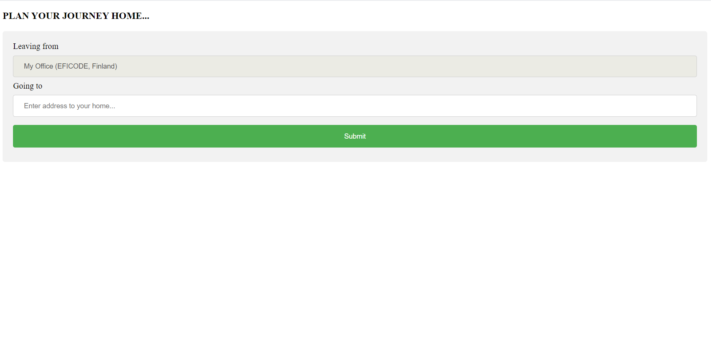
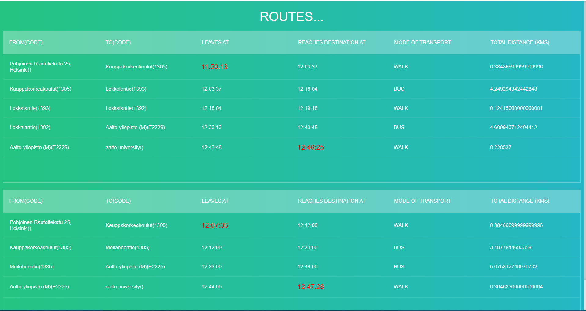

# EficodeAssignment
- code for the summer job 2020 assignment

### To deploy:
1. Install docker and clone the repository.
2. run the following command to build the docker image :
    ```
    docker build -t eficode .
    ```
3. Run the container and expose container's port 8080 to host port 80.
   ```
   docker run -d -p 80:8080 eficode
   ```
   
   

### Visit the website in the browser : http://host_ip


After Submiting the location of your choice, it shows 3 possible routes from eficode's office to the destination.


